

  <!-- Build Status -->
  
   

  <!-- Test Coverage -->
  

<h3 align="center">Questo è un software per il gioco degli scacchi per 2 giocatori, sviluppato con Java per console.</h3>

  
# Indice
---

1. ### <a href="#int" >Introduzione</a>

2. ### <a href="#mod" >Modello di dominio</a>

3. ### <a href="#req" >Requisiti specifici</a>

4. ### <a href="#00d" >00 Design</a>

5. ### <a href="#sum" >Riepilogo del test  </a>

6. ### <a href="#man" >Manuale utente</a>

7. ### <a href="#dev" >Processo di sviluppo e organizzazione del lavoro</a>

8. ### <a href="#ana" >Analisi retrospettiva</a>

   
# 
1. Introduzione 

---

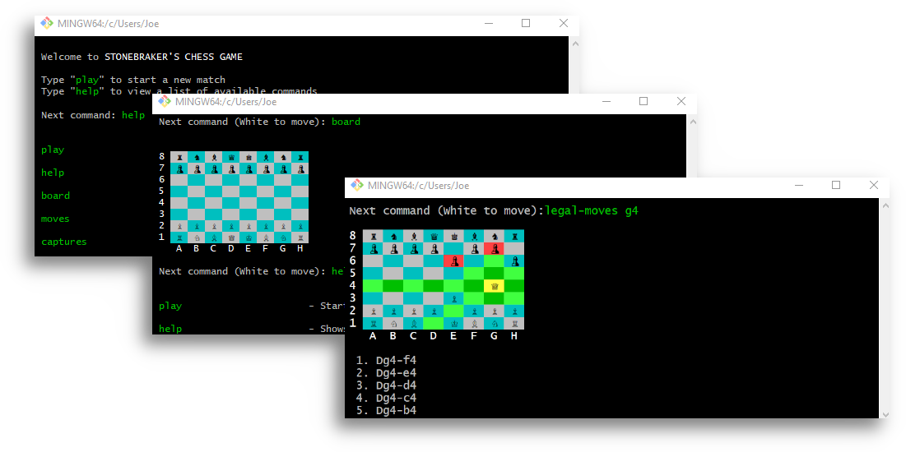

## 1.1 Il Progetto

Questo è il progetto presentato del team **Stonebraker** come prova di esonero per il corso di Ingegneria del Software a.a. 2019-2020. L'applicazione sviluppata in Java permette di disputare una partita tra due giocatori, con un interfaccia realizzata interamente per l'esecuzione da console (CLI), che permette la gestione dello svolgimento della partita e una serie di funzionalita aggiuntive che facilitano l'utente nel controllo della partita.

## 1.2 Il Team

| [ <b>Honda02</b>](https://github.com/Honda02) |[ <b>Xav147</b>](https://github.com/Xav147) |[ <b>claudiovalen</b>](https://github.com/claudiovalen) |[ <b>Giuseppecapozza</b>](https://github.com/Giuseppecapozza) |[ <b>l-alicino</b>](https://github.com/l-alicino) |[ <b>Amiri21</b>](https://github.com/Amiri21) 
| :-: | :-: | :-: | :-: | :-: | :-: |

   
# 
2. Modello di dominio

   
# 
3. Requisiti specifici

## **3.1 Requisiti funzionali**
Questa sezione include i requisiti che specificano tutte le azioni fondamentali del sistema software.
-  Il giocatore deve poter visualizzare l’elenco dei comandi disponibili.
-  Il giocatore deve poter iniziare una nuova partita.
-  Il giocatore deve poter visualizzare la scacchiera.
-  Il giocatore deve poter visualizzare le catture.
-  Il giocatore deve poter visualizzare il vantaggio materiale.
-  Il giocatore deve poter chiudere il gioco.
-  Il bianco è il primo a muoversi. 
-  Il giocatore deve poter muovere i pezzi inserendo la notazione algebrica della mossa che vuole eseguire.
-  Il giocatore deve poter catturare i pezzi avversari inserendo la notazione algebrica della mossa che vuole eseguire.
-  Il giocatore deve poter visualizzare le mosse legali disponibili.
-  Il giocatore deve poter visualizzare le mosse legali disponibili per un singolo pezzo.
-  Un giocatore può offrire patta in qualsiasi momento.
-  Un giocatore deve ricevere un avviso con richiesta di conferma prima di pareggiare.
-  Il pareggio porta al termine del gioco. 
-  Un giocatore può rinunciare in qualsiasi momento durante il gioco. 
-  Un giocatore deve ricevere un avviso con richiesta di conferma prima di rinunciare.
-  La rinuncia da parte di un giocatore porta al termine del gioco.

## **3.2 Requisiti non funzionali**
-  I pezzi della scacchiera devono essere visualizzati in carattere Unicode
-  Il codice deve rispettare le specifiche di stile di CheckStyle
-  Le segnalazioni di SpotBugs devono essere risolte
-  Le Javadoc devono trovarsi nella cartella doc/javadoc/
-  I test di unità devono trovarsi nella cartella src/test/
-  Devono essere applicati i principi dell'Object Oriented Design
-  Il linguaggio di programmazione utilizzato deve essere Java

### **3.2.1 Elenco dei terminali supportati**
Di seguito l’elenco dei terminali su cui poter eseguire il container dell’app scacchi:

Linux:
- terminal

Mac OS
- terminal

Windows
- Terminal del sottosistema Windows per Linux
- Git Bash (in questo caso il comando Docker ha come prefisso winpty; es: winpty docker -it ....)

   
# 
4. 00 Design

## 4.1 Diagramma delle Classi

### 4.1.2 Diagramma Completo

### 4.1.3 Diagramma Barebones

## 4.2 Decisioni prese

### **4.2.1 AppMain**

Sequence diagram della user story Play

L'**AppMain** è la classe principale del programma, si interfaccia con l'utente attraverso una serie di messaggi, gestendo il flusso di esecuzione del programma.

È una classe di natura molto semplice in quanto si occupa di ricevere l'input dall'utente e inviarlo alla classe **Controller**. Dopo aver ricevuto la conferma della validità dell'input, esegue le dovute procedure.

### **4.2.2 Controller**

Il **Controller** è la classe pensata per controllare la validità dell'input inserito dall'utente.

È un componente di supporto ad **AppMain**, in quanto rimuove da quest'ultima il compito di controllare ciò che scrive l'utente. 
È pensata per essere ad alta coesione, a basso accoppiamento e facilmente espandibile; l'aggiunta di un nuovo comando è semplice e veloce.

### **4.2.3 Game**

**Game** rappresenta la singola partita, al suo interno viene gestita la scacchiera, ed il formulario delle mosse.

Contiene informazioni di stato sulla partita, ad esempio: il turno, l'ultima mossa effettuata ecc.

Sequence diagram della user story Captures

### **4.2.4 Board**

La classe **Board** rappresenta l'astrazione di una scacchiera e gestisce la logica di tutta la partita.

Si occupa di ospitare i due giocatori, bianco e nero, aggiornando il loro stato e gestendo l'impatto che le decisioni di entrambi hanno sulla partita. È predisposta per la possibilità di importare partite.

Sequence diagram della user story Move

### **4.2.5 Player**

La classe **Player** rappresenta l'astrazione del giocatore.

Al suo interno racchiude tutto ciò che è essenziale per il giocatore:
- Pezzi a sua disposizione, rappresentati dalla classe **Piece**
- Pezzi avversari catturati
- Mosse legali possibili, rappresentate dalla classe **Move**

### **4.2.6 Piece**

La classe **Piece** rappresenta l'astrazione del singolo pezzo.

Contiene le informazioni relative allo stato del pezzo:
- Il tipo di pedina
- Il colore a cui appartiene
- Se è stato mosso precedentemente

### **4.2.7 Move**

**Move** rappresenta l'astrazione di una mossa.

Contiene le informazioni sulla mossa che può essere effettuata da un giocatore.

Nello specifico:
- Coordinate di partenza
- Coordinate di arrivo
- Notazione estesa della mossa

### **4.2.8 ChessForm**

Sequence diagram della user story Moves

**ChessForm** rappresenta l'astrazione del formulario delle mosse, gestisce la storia della singola partita.

Ha responsabilità ben definite: tiene traccia di tutte le mosse effettuate dai due giocatori e del risultato della partita.

### **4.2.9 Ansi**

**Ansi** è una classe noECB, viene utilizzata per memorizzare i colori per la stampa della scacchiera e dei vari messaggi.

### **4.2.10 Note** 

Abbiamo deciso di tenere tutte le classi importanti con visibilità **public**, andando contro quanto consigliato da CheckStyle, in quanto necessario per la gestione dei casi di test.

   
# 
5. Riepilogo del test

  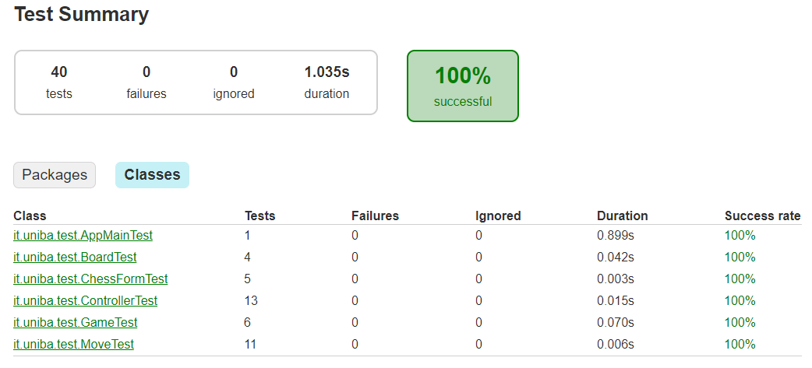

 

  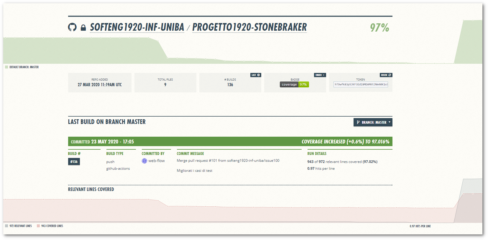

 

  

[Link a Coveralls](https://coveralls.io/github/softeng1920-inf-uniba/progetto1920-stonebraker)

   
# 
6. Manuale utente

Segue la lista di tutti i comandi disponibili con la descrizione delle loro funzionalita ed una loro **demo** in console.

## Play

È possibile utilizzare il comando ``play`` in qualsiasi momento per chiedere all'applicazione di avviare una nuova partita con mossa al bianco. Se precedentemente al comando è stata terminata una partita oppure questa è ancora in corso, il gioco chiedera conferma ed in caso positivo avvierà una nuova partita.  

<b>Visualizza play in console</b>

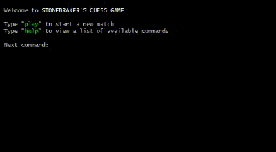

 

---

## Help

È possibile utilizzare il comando ``help`` in qualsiasi momento per saperne di più sull'utilizzo e sulla sintassi di un comando, ad esempio quali opzioni sono disponibili e come comporre effettivamente il comando.

<b>Visualizza help in console</b>

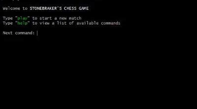

 

---

## Board

Sia durante una partita che una volta terminata, è possibile utilizzare il comando ``board`` per visualizzare la posizione attuale sulla scacchiera.

<b>Visualizza board in console</b>

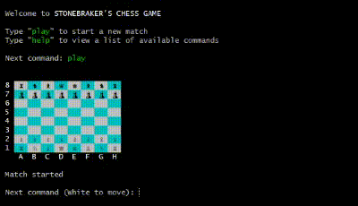

 

---

## Moves

Sia durante una partita che una volta terminata, è possibile utilizzare il comando ``moves`` per visualizzare il formulario della partita con tutte le mosse giocate sino a quel momento ed eventualmente il risultato della partita.  

<b>Visualizza moves in console</b>

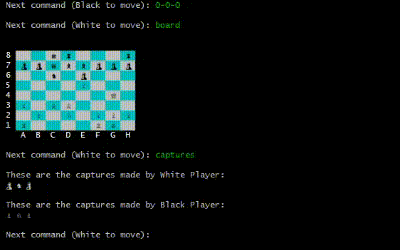

 

---

## Captures

Sia durante una partita che una volta terminata, è possibile utilizzare il comando ``captures`` per visualizzare l'elenco di tutte le catture effettuate dai due giocatori.  

<b>Visualizza captures in console</b>

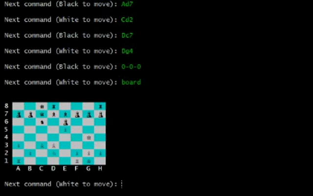

 

---

## Move

Durante una partita, il giocatore possono inserire le mosse che intendono effetuare in [notazione algebrica](https://it.wikipedia.org/wiki/Notazione_algebrica). Nel corso della partita verrà sempre visualizzato il turno in atto prima dell'inserimento del comando. In caso di errore nell'inserimento o di mossa non valida verrà visualizzato l'errore corrispondente e il giocatore potrà reiserire la mossa.

<b>Visualizza move in console</b>

 

---

## Legal-moves

Durante una partita, uno giocatore può utilizzare il comando ``legal-moves`` per visualizzare l'elenco completo delle mosse disponibili nella sua posizione, visualizzate in [notazione algebrica](https://it.wikipedia.org/wiki/Notazione_algebrica) estesa.

<b>Visualizza legal-moves in console</b>

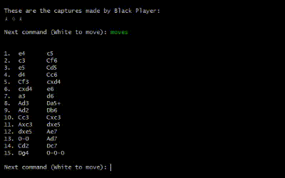

Una variante del comando permette al giocatore di utilizzare ``legal-moves [square]`` per visualizzare sulla scacchiera le mosse legali per il pezzo presente nello ``[square]`` selezionato, evidenziando il pezzo in giallo, le possibili mosse in verde e le catture in rosso. Segue l'elenco completo delle mosse disponibili nella sua posizione.

<b>Visualizza legal-moves [square] in console</b>

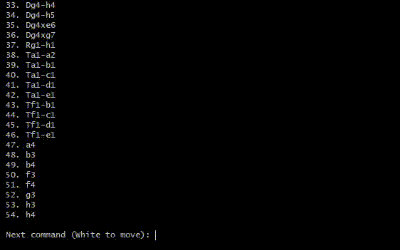

 

---

## Material

Sia durante una partita che una volta terminata, è possibile utilizzare il comando ``material`` per visualizzare l'elenco di tutte le pedine di entrambi i giocatori e il calcolo del loro [valore materiale](https://it.wikipedia.org/wiki/Valore_dei_pezzi_degli_scacchi) . 

<b>Visualizza material in console</b>

 

---

## Draw

Durante una partita, uno dei giocatori può decidere di chiedere al suo avversario la patta, utilizzando il comando ``draw``. Il gioco chiedera al suo avversario se intende accettare o negare la patta. Se l'avversario decide di accettare, la partita terminerà in parità, altrimenti si riprende il normale svoglimento del gioco.

<b>Visualizza draw in console</b>

 

---

## Resign

Durante una partita, uno dei giocatori può decidere di arrendersi utilizzando il comando ``resign`` e conferma la sua scelta. Il gioco terminerà immediatamente dichiarando il suo avversario come vincitore. Se il giocatore decide di non confermare la sua scelta, il giocatore riprende normalmente.

<b>Visualizza resign in console</b>

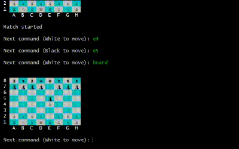

 

---

## Quit

Quando si intende chiudere l'applicazione il giocatore può utilizzare il comando ``quit``.
Una volta confermata la propria scelta l'applicazione verra terminata.

<b>Visualizza quit in console</b>

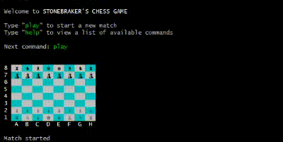

 

   
# 
7. Processo di sviluppo e organizzazione del lavoro

## 7.1 Git History Grafico

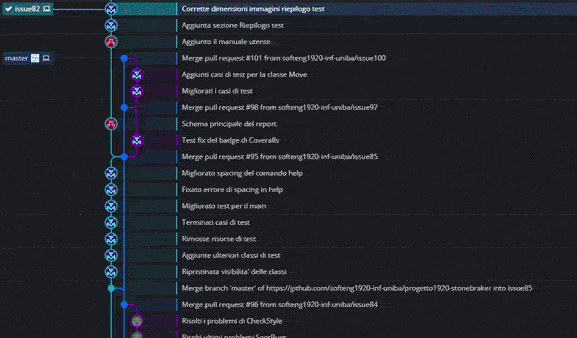
  

<b>Visualizza l'history completa</b>

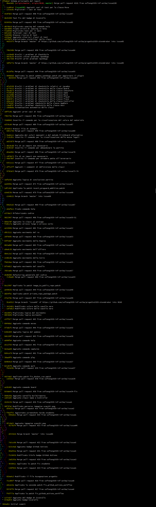

 

## 7.2 Metodologie di sviluppo utilizzate

### **7.2.1 Sviluppo Agile**

Lo [Sviluppo Agile](https://it.wikipedia.org/wiki/Metodologia_agile) un insieme di metodi di sviluppo del software fondati su un insieme di principi comuni, direttamente o indirettamente derivati dai principi del ["Manifesto per lo sviluppo agile del software"](https://agilemanifesto.org/iso/it/manifesto.html/) pubblicato nel 2001 da Kent Beck, Robert C. Martin, Martin Fowler e altri.

### **7.2.2 Sviluppo Iterativo**

Per [Sviluppo Iterativo](https://it.wikipedia.org/wiki/Modello_incrementale) si intende, nell'ambito dell'ingegneria del software, un modello di sviluppo di un progetto software basato sulla successione dei seguenti passi principali:

- pianificazione
- analisi dei requisiti
- progetto
- implementazione
- prove
- valutazione

### **7.2.3 Github Flow**

[Github Flow](https://guides.github.com/introduction/flow/) è un flusso di lavoro semplice, branch-based che supporta team e progetti in cui le distribuzioni vengono eseguite regolarmente.

 

## 7.3 Sprint Workflow

### **7.3.1 Pianificazione**

All'inizio di ogni Sprint il primo step è stato quello di valutare di primo acchito, in base alle capacità di ognuno, come suddividere i compiti del backlog. Ci siamo assegnati il da farsi tenendo conto delle abilità e prefenze di ognuno di noi. In conclusione ci siamo prefissati una data di consegna intermedia.
 
### **7.3.2 Sviluppo**

Terminata la fase di pianificazione, gli incontri successivi sono stati dedicati allo sviluppo. Abbiamo cercato di tenerci in contatto durante tutta la fase di sviluppo, definendo incontri settimanali, affinché la gestione di eventuali problemi e difficolta fosse agevolata dalla presenza del gruppo con cui confrontarsi.

### **7.3.3 Revisione intermedia**

La revisione intermedia ci ha permesso di controllare lo stato di avanzamento del lavoro, consentendoci di valutare più accuratamente i risultati delle scelte fatte durante la pianificazione iniziale, ed eventualmente supportare chi ha avuto dei problemi nello sviluppo del proprio compito. 

### **7.3.4 Consegna**

Questa è l'ultima fase di revisione dello Sprint nella quale abbiamo valutato se il lavoro fosse stato terminato e rispettasse le direttive iniziale. Dopo il controllo, segue il messaggio di conferma su Slack.

   

# 
8. Analisi retrospettiva

Giunti alla conclusione del progetto ed analizzando tutto il percorso a 360 gradi, possiamo affermare che quest’esperienza ci ha regalato tante soddisfazioni sia a livello personale, sia considerando il lavoro eseguito, ma anche momenti di insoddisfazione e difficoltà.

 

## 8.1 Cosa ci ha fatto sentire soddisfatti

### 8.1.1 **Il lavoro di gruppo**

Senza dubbio all’inizio è stato difficile poiché non c’era mai capitato prima di lavorare con un gruppo così numeroso. C’è stato qualche momento di imbarazzo iniziale, ma col tempo fortunatamente è andato scomparendo. Siamo quindi riusciti a confrontarci con sempre più facilità, chi aveva qualche conoscenza in più è sempre stato disponibile nel condividerla e tra una battuta e l’altra lavorare insieme è quindi diventato sempre più facile. Quindi riteniamo che una tra le più grandi soddisfazioni di questo lavoro, al di là del progetto vero e proprio, sia proprio quella di aver creato un’inaspettata intesa tra noi che speriamo potrà proseguire nel tempo e che sicuramente porterà anche ad un incontro di persona.

### 8.1.2 **Strumenti utilizzati**

Naturalmente, oltre all’ambito relazionale, siamo molto soddisfatti di quest’esperienza dal momento che ci ha fatto interfacciare con diversi programmi e piattaforme, permettendoci di maturare a livello professionale. Strumenti come Git, Slack, Docker ecc. si sono dimostrati tools utilissimi da utilizzare un domani in ambito lavorativo.

### 8.1.3 **Super Plus**

Uno dei risultati della coordinazione durante lo sviluppo è la visualizzazione a colori della scacchiera, un aspetto magari a primo impatto anche banale ma che in realtà ci ha fatto guadagnare diversi consensi dai compagni ed un “superplus” dal professore, che ha apprezzato questa particolarità. Non possiamo quindi nascondere che ciò ci ha resi molto contenti e soddisfatti del lavoro svolto in qualità di team.

 

## 8.2 Cosa ci ha fatto sentire insoddisfatti

### 8.2.1 **COVID-19**

Sfortunatamente ci siamo trovati improvvisamente ad affrontare questo progetto durante l'emergenza covid-19. L’impossibilità di incontrarsi di persona e lo stress dovuto alla quarantena, almeno inizialmente, hanno reso le cose un po’ più complicate del previsto in quanto, nonostante la tecnologia ci permetta di poter comunicare, l’incontro nella vita reale ci avrebbe dato la possibilità di conoscerci meglio e quindi di poter essere più a nostro agio durante lo sviluppo del progetto.

### 8.2.2 **La divisione dei compiti e la gestione dei tempi**

Abbiamo avuto qualche difficoltà nell’organizzarci sui giorni e sull’orario nel quale incontrarci, essendo di corsi diversi e avendo orari di lezione spesso incompatibili tra loro. Questo ha portato, alle volte, ad avere un grande carico di attività da svolgere in tempi ridotti, di conseguenza, a un lavoro più intenso. Dunque ci auguriamo di migliorare la gestione dei tempi nei progetti futuri.

 

## 8.3 Cosa ci ha fatto «impazzire»

### 8.3.1 **Primo approccio ai tools di sviluppo**

Ovviamente anche qui non sono mancati alcuni ostacoli iniziali: Git, Docker, Checkstyle e Spotbugs erano una novità assoluta e quindi è servito un po’ di tempo per ingranare e prendere dimestichezza con essi, soprattutto per capire bene come utilizzarli in maniera congiunta e non indipendente.

### 8.3.2 **Calcolo delle mosse**

Per quanto riguarda le mosse inserite dall'utente, inizialmente abbiamo provato a verificare se la mossa inserita risultasse legale secondo le regole degli scacchi, ma visto il risultato negativo nello Sprint 1 con il solo movimento del pedone e dato che la lista delle mosse possibili era prevista dal Product backlog abbiamo deciso di seguire quella direzione. Il calcolo delle mosse possibili in base alla posizione sulla scacchiera ci ha fatto disperare ma siamo felici del risultato che ci ha facilitato l'inserimento funzionalità aggiuntive all'applicazione.
